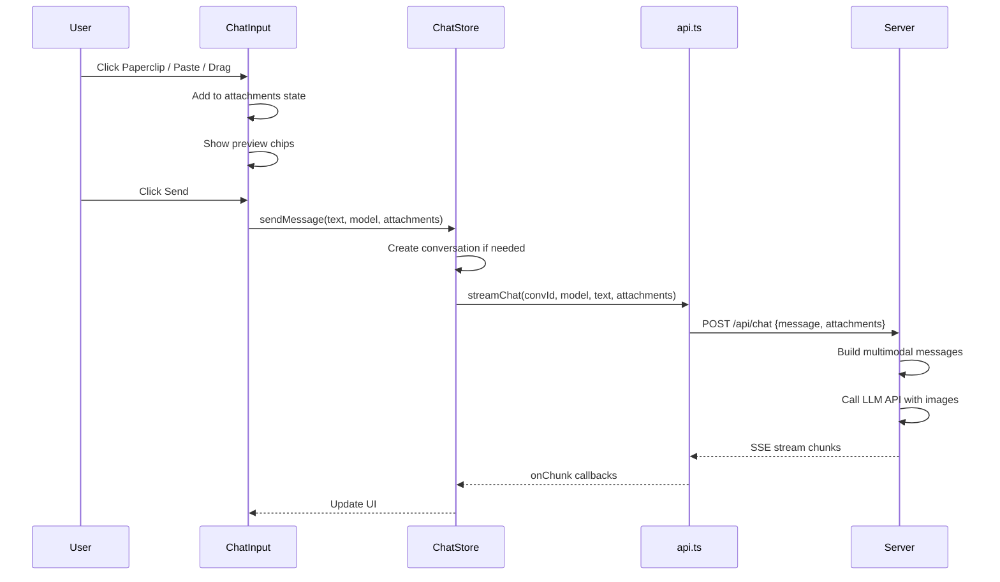
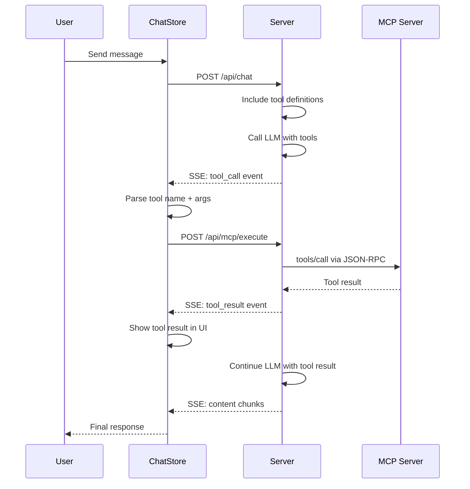

# Chat Input Features: File Upload, Paste Image, MCP Client

> **Created**: 2026-06-16
> **Status**: Planning

---

## Overview

Three features to enhance the chat input:
1. **File Upload** — Attach files (images, PDFs, docs) via the Paperclip button or drag-and-drop
2. **Paste Image** — Paste images from clipboard directly into the composer
3. **MCP Client** — Connect to external MCP tool servers so the AI can call tools during chat

---

## Feature 1: File Upload

### Current State
- [`Paperclip`](client/src/components/chat/ChatInput.tsx:84) button exists but is not wired
- Server [`ChatRequest`](server/src/types.ts:177) already has `attachments?: { filename, mimeType, base64 }[]`
- [`Attachment`](client/src/types/index.ts:54) type exists on client
- [`Message`](client/src/types/index.ts:44) has `attachments?: Attachment[]`

### Architecture

```
User clicks Paperclip / drags file / pastes image
        │
        ▼
┌─────────────────────┐
│  FilePreview area    │  Shows thumbnail chips above the textarea
│  (above textarea)    │  Each chip has remove button
└─────────┬───────────┘
          │ On Send
          ▼
┌─────────────────────┐
│  ChatInput reads     │  Converts files to base64
│  attachments state   │  Passes to sendMessage()
└─────────┬───────────┘
          │
          ▼
┌─────────────────────┐
│  chatStore           │  sendMessage now accepts attachments
│  streamChat()        │  Sends attachments in POST body
└─────────┬───────────┘
          │
          ▼
┌─────────────────────┐
│  Server chat route   │  Builds multimodal messages array
│                      │  Sends image_url parts to OpenAI-compatible API
└─────────────────────┘
```

### Implementation Steps

**Client:**
1. Add `attachments` state to [`ChatInput`](client/src/components/chat/ChatInput.tsx) — array of `{ file: File, preview: string }`
2. Wire Paperclip button to hidden `<input type="file">` (accept images, PDFs, docs)
3. Add `onPaste` handler to textarea — detect `ClipboardItem` with image MIME type
4. Add drag-and-drop handler on the composer container
5. Render file preview chips above the textarea (thumbnail for images, icon+name for docs)
6. Each chip has an X button to remove
7. On send, convert files to base64 and pass to [`sendMessage()`](client/src/stores/chatStore.ts:87)
8. Update [`streamChat()`](client/src/services/api.ts:69) to accept and send attachments
9. Update [`MessageBubble`](client/src/components/chat/MessageBubble.tsx) to render image attachments inline

**Server:**
10. Update [`chat route`](server/src/routes/chat.ts:10) to parse `attachments` from request body
11. Build multimodal content array for OpenAI API:
    - Images: `{ type: "image_url", image_url: { url: "data:mime;base64,..." } }`
    - Text: `{ type: "text", text: message }`
12. Save attachment metadata to `attachments` table

---

## Feature 2: Paste Image

Integrated into Feature 1. The `onPaste` handler in step 4 above handles:
- Detect `e.clipboardData.items` for `image/*` types
- Convert `DataTransferItem.getAsFile()` to File object
- Generate preview URL via `URL.createObjectURL()`
- Add to attachments state

---

## Feature 3: MCP Client Integration

### What is MCP?
Model Context Protocol (MCP) is a standard for connecting AI models to external tool servers. An MCP server exposes a list of "tools" (functions) that the AI can call. The client discovers tools, passes their schemas to the LLM, and when the LLM responds with a tool call, the client executes it against the MCP server and returns the result.

### Architecture

```
┌──────────────────────────────────────────────────┐
│                  Settings Page                    │
│  MCP Servers section:                             │
│  - Add/remove MCP server URLs (SSE transport)     │
│  - Shows discovered tools per server              │
│  - Enable/disable individual tools                │
└─────────────────────┬────────────────────────────┘
                      │
                      ▼
┌──────────────────────────────────────────────────┐
│              mcpStore (Zustand)                   │
│  - Connected servers & their tools                │
│  - Tool definitions (JSON Schema)                 │
│  - Connection status per server                   │
└─────────────────────┬────────────────────────────┘
                      │
                      ▼
┌──────────────────────────────────────────────────┐
│              mcpService (client)                  │
│  - Connect to MCP server via SSE                  │
│  - tools/list → discover available tools          │
│  - tools/call → execute a tool                    │
│  - Auto-reconnect on disconnect                   │
└─────────────────────┬────────────────────────────┘
                      │
                      ▼
┌──────────────────────────────────────────────────┐
│              Server: Chat Route                   │
│  - Receives tool definitions from client          │
│  - Includes tools in OpenAI API request           │
│  - Streams tool_calls in response                 │
│  - Returns tool_call events to client             │
└─────────────────────┬────────────────────────────┘
                      │
                      ▼
┌──────────────────────────────────────────────────┐
│              Client: Chat Store                   │
│  - On receiving tool_call event:                  │
│    1. Parse tool name + arguments                 │
│    2. Find matching MCP server                    │
│    3. Call mcpService.tools/call                  │
│    4. Send tool result back to server             │
│    5. Continue streaming assistant response       │
└──────────────────────────────────────────────────┘
```

### MCP Protocol Details

MCP uses JSON-RPC 2.0 over SSE (Server-Sent Events) for client→server communication:

1. **Connect**: Client opens SSE connection to MCP server URL
2. **Initialize**: `initialize` handshake with protocol version
3. **Discover Tools**: `tools/list` returns array of tool definitions
4. **Call Tool**: `tools/call` with `name` and `arguments` returns result

### Implementation Steps

**Database:**
1. Add `mcp_servers` table: id, name, url, enabled, status, created_at
2. Add `mcp_tools` table: id, server_id, name, description, input_schema, enabled

**Server:**
3. Create [`routes/mcp.ts`](server/src/routes/mcp.ts) — CRUD for MCP server configs
4. Create [`services/mcpClient.ts`](server/src/services/mcpClient.ts) — MCP protocol client
   - SSE connection management
   - JSON-RPC message handling
   - Tool discovery and execution
5. Update [`chat route`](server/src/routes/chat.ts) to:
   - Load enabled MCP tools from DB
   - Include `tools` parameter in OpenAI API request
   - Handle `tool_calls` in streaming response
   - Execute tool calls via MCP client
   - Continue generation with tool results

**Client:**
6. Create [`services/mcpApi.ts`](client/src/services/mcpApi.ts) — MCP server CRUD API
7. Create [`stores/mcpStore.ts`](client/src/stores/mcpStore.ts) — MCP state management
8. Add MCP Servers section to [`SettingsPage`](client/src/components/settings/SettingsPage.tsx)
9. Update [`MessageBubble`](client/src/components/chat/MessageBubble.tsx) to render tool call/result blocks
10. Add MCP status indicator in chat header or sidebar

---

## Database Schema Additions

```sql
-- MCP Servers configuration
CREATE TABLE IF NOT EXISTS mcp_servers (
  id TEXT PRIMARY KEY,
  name TEXT NOT NULL,
  url TEXT NOT NULL,
  enabled INTEGER NOT NULL DEFAULT 1,
  status TEXT NOT NULL DEFAULT 'disconnected',
  last_connected TEXT,
  created_at TEXT NOT NULL DEFAULT (datetime('now')),
  updated_at TEXT NOT NULL DEFAULT (datetime('now'))
);

-- Discovered tools from MCP servers
CREATE TABLE IF NOT EXISTS mcp_tools (
  id TEXT PRIMARY KEY,
  server_id TEXT NOT NULL,
  name TEXT NOT NULL,
  description TEXT,
  input_schema TEXT NOT NULL DEFAULT '{}',
  enabled INTEGER NOT NULL DEFAULT 1,
  created_at TEXT NOT NULL DEFAULT (datetime('now')),
  FOREIGN KEY (server_id) REFERENCES mcp_servers(id) ON DELETE CASCADE
);

CREATE INDEX IF NOT EXISTS idx_mcp_tools_server ON mcp_tools(server_id);
```

---

## Flow Diagrams

### File Upload + Send Flow



### MCP Tool Call Flow



---

## File Changes Summary

| # | File | Action | Description |
|---|------|--------|-------------|
| 1 | `server/src/database.ts` | Modify | Add mcp_servers and mcp_tools tables |
| 2 | `server/src/types.ts` | Modify | Add MCP types |
| 3 | `server/src/routes/mcp.ts` | Create | MCP server CRUD + tool execution endpoint |
| 4 | `server/src/services/mcpClient.ts` | Create | MCP protocol client (SSE + JSON-RPC) |
| 5 | `server/src/routes/chat.ts` | Modify | Add multimodal content + tool call handling |
| 6 | `server/src/index.ts` | Modify | Wire MCP routes |
| 7 | `client/src/types/index.ts` | Modify | Add MCP and attachment preview types |
| 8 | `client/src/services/api.ts` | Modify | Update streamChat with attachments + tool calls |
| 9 | `client/src/services/mcpApi.ts` | Create | MCP server CRUD API client |
| 10 | `client/src/stores/chatStore.ts` | Modify | Handle attachments and tool call flow |
| 11 | `client/src/stores/mcpStore.ts` | Create | MCP state management |
| 12 | `client/src/components/chat/ChatInput.tsx` | Modify | File upload, paste, drag-drop, preview chips |
| 13 | `client/src/components/chat/MessageBubble.tsx` | Modify | Render attachments and tool call blocks |
| 14 | `client/src/components/chat/ToolCallBlock.tsx` | Create | Tool call/result display component |
| 15 | `client/src/components/settings/SettingsPage.tsx` | Modify | Add MCP Servers section |
| 16 | `client/src/components/settings/McpServerManager.tsx` | Create | MCP server CRUD UI |
