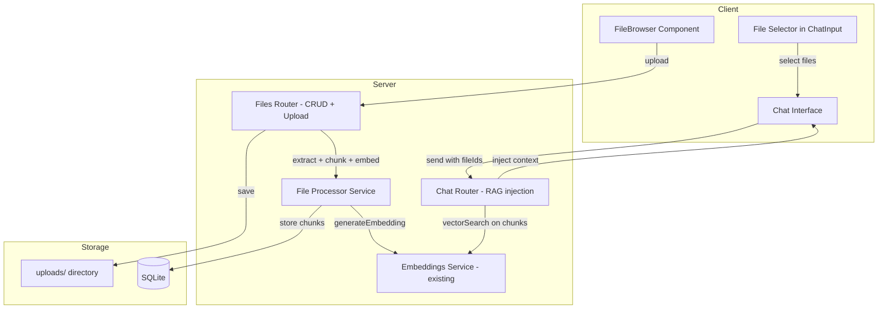

# File Library with Vector Indexing & RAG Chat

## Overview

Add a **File Library** feature that allows users to upload files/folders, automatically processes them into vector embeddings, and enables RAG-based chat where the AI uses selected files as context.

## Architecture



## Database Schema

### `file_library` table
```sql
CREATE TABLE IF NOT EXISTS file_library (
  id TEXT PRIMARY KEY,
  original_name TEXT NOT NULL,
  stored_name TEXT NOT NULL,
  mime_type TEXT NOT NULL,
  file_size INTEGER NOT NULL,
  chunk_count INTEGER NOT NULL DEFAULT 0,
  status TEXT NOT NULL DEFAULT 'processing' CHECK(status IN ('processing', 'ready', 'error')),
  error_message TEXT,
  uploaded_by TEXT REFERENCES users(id) ON DELETE SET NULL,
  created_at TEXT NOT NULL DEFAULT (datetime('now')),
  updated_at TEXT NOT NULL DEFAULT (datetime('now'))
);
```

### `file_chunks` table
```sql
CREATE TABLE IF NOT EXISTS file_chunks (
  id TEXT PRIMARY KEY,
  file_id TEXT NOT NULL,
  chunk_index INTEGER NOT NULL,
  content TEXT NOT NULL,
  embedding TEXT,
  token_count INTEGER DEFAULT 0,
  created_at TEXT NOT NULL DEFAULT (datetime('now')),
  FOREIGN KEY (file_id) REFERENCES file_library(id) ON DELETE CASCADE
);
CREATE INDEX IF NOT EXISTS idx_file_chunks_file ON file_chunks(file_id);
```

## Text Chunking Strategy

- **Chunk size**: ~1000 characters (roughly 250-300 tokens)
- **Overlap**: 200 characters between chunks for context continuity
- **Split points**: Prefer splitting at paragraph boundaries (`\n\n`), then sentence boundaries (`. `), then word boundaries
- Uses existing `extractFileText()` from chat.ts for text extraction

## API Endpoints

### `POST /api/files/upload`
- Uses `multer` (already in dependencies) for multipart upload
- Supports multiple files in one request
- Saves to `uploads/` directory with UUID-based stored_name
- Triggers async processing (extract → chunk → embed)
- Returns file metadata immediately with `status: 'processing'`

### `GET /api/files`
- List all files with metadata and chunk counts
- Query params: `page`, `limit`

### `GET /api/files/:id`
- Get single file details with chunk info

### `GET /api/files/:id/chunks`
- Get chunks for a file (paginated)

### `DELETE /api/files/:id`
- Delete file from disk + DB (chunks cascade deleted)

### `POST /api/files/:id/reindex`
- Re-process a file (re-extract, re-chunk, re-embed)

### `POST /api/files/search`
- Body: `{ query: string, fileIds?: string[], limit?: number }`
- Searches across file chunks using vector similarity
- Returns relevant chunks with file metadata

## Chat Integration

### ChatRequest update
Add optional `fileIds: string[]` to the chat request body.

### RAG flow in chat.ts
```typescript
// After memory injection, before building API messages:
if (fileIds && fileIds.length > 0) {
  const queryEmbedding = await generateEmbedding(message);
  const relevantChunks = searchFileChunks(db, queryEmbedding, fileIds, 5);
  if (relevantChunks.length > 0) {
    const fileContext = relevantChunks
      .map(c => `[${c.fileName}] ${c.content}`)
      .join('\n\n');
    apiMessages.unshift({
      role: 'system',
      content: `以下是从文件库中检索到的相关内容：\n${fileContext}\n\n请基于这些文件内容回答用户的问题。`
    });
  }
}
```

## Client Components

### `FileBrowser.tsx`
- Upload area (drag & drop + file picker)
- File list with status indicators (processing/ready/error)
- Delete and reindex actions
- Accessible from Sidebar (new button like Memory Store)

### `FileSelector.tsx` (in ChatInput)
- Small button/dropdown to select files for the current conversation
- Shows selected files as chips/tags
- Persists selection per conversation

### `fileStore.ts` (Zustand)
- State: files, selectedFileIds, loading
- Actions: fetchFiles, uploadFiles, deleteFile, reindexFile, setSelectedFiles

## Supported File Types
- **Text**: .txt, .md, .csv, .json, .xml, .html, .yaml, .toml, .ini, .log, .sql
- **Code**: .js, .ts, .py, .java, .c, .cpp, .h, .rs, .go, .rb, .php, .sh, .vue, .jsx, .tsx
- **Documents**: .pdf
- **Binary detection**: Skip files with >10% non-printable characters

## File Size Limits
- Max file size: 20MB per file (matches existing attachment limit)
- Max total upload: 100MB per request

## Railway Considerations
- Files stored in `/data/uploads/` (alongside SQLite DB)
- Need to create `uploads/` directory on startup
- Files persist across deploys if Railway Volume is configured at `/data`

## Implementation Order

1. Database: Add `file_library` and `file_chunks` tables
2. Server types: Add FileLibraryEntry, FileChunk interfaces
3. Server service: File processing (extract + chunk + embed)
4. Server routes: File CRUD + upload + search endpoints
5. Server index.ts: Register `/api/files` route
6. Chat integration: Add fileIds to ChatRequest, RAG injection
7. Client types: Add file-related interfaces
8. Client API: Add fileApi endpoints
9. Client store: fileStore.ts
10. Client UI: FileBrowser component
11. Client UI: FileSelector in ChatInput
12. i18n: Add file library keys
13. TypeScript compilation check
14. Commit, push, deploy
