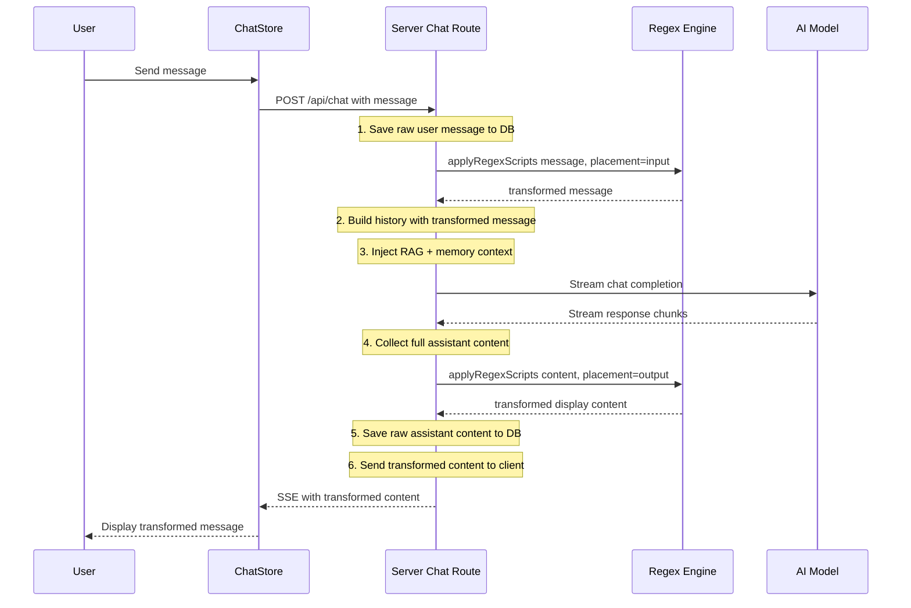

# SillyTavern-style Regex Scripts & Presets System

## Overview

Implement a regex script and preset system inspired by SillyTavern (酒馆), enabling users to define regex-based text transformations that process messages before sending to the AI and after receiving responses. This is particularly useful for transcribing/processing NSFW content by transforming sensitive terms in prompts and decoding responses.

## How SillyTavern's System Works

In SillyTavern, regex scripts are JavaScript-flavored regex patterns that transform message text at specific points in the pipeline:

- **User Input (outgoing)**: Transform the user's message before it's sent to the API — e.g., replace explicit words with coded/acceptable alternatives
- **AI Output (incoming)**: Transform the AI's response after it's received — e.g., decode the coded language back to intended display text
- **Both**: Apply to both directions

Scripts are grouped into **Presets** — named collections that can be saved, loaded, exported, and toggled as a unit. Users typically create multiple presets for different scenarios and switch between them quickly.

## Architecture

### Data Flow with Regex Integration



### Key Design Decisions

1. **Raw vs Transformed Storage**: The database stores the **original raw** messages. Regex transformations are applied **on-the-fly** during the chat pipeline. This preserves data integrity and allows changing regex rules without corrupting history.
2. **Server-side Processing**: Regex runs on the server in `chat.ts` so the AI model sees the transformed input, and the client sees the transformed output. This is critical for NSFW content processing.
3. **Per-user Presets**: Each user has their own set of presets. The active preset is tracked per-conversation.
4. **Script Priority**: Scripts have an `order` field for deterministic execution sequence.

## Database Schema

### Table: `regex_scripts`

```sql
CREATE TABLE IF NOT EXISTS regex_scripts (
  id TEXT PRIMARY KEY,
  name TEXT NOT NULL,
  find_pattern TEXT NOT NULL,       -- The regex pattern to match
  replacement TEXT NOT NULL DEFAULT '', -- The replacement string
  flags TEXT NOT NULL DEFAULT 'g',   -- Regex flags: g, i, m, s, etc.
  placement TEXT NOT NULL DEFAULT 'both' CHECK(placement IN ('input', 'output', 'both')),
  enabled INTEGER NOT NULL DEFAULT 1,
  script_order INTEGER NOT NULL DEFAULT 0,
  user_id TEXT REFERENCES users(id) ON DELETE CASCADE,
  created_at TEXT NOT NULL DEFAULT (datetime('now')),
  updated_at TEXT NOT NULL DEFAULT (datetime('now'))
);
CREATE INDEX IF NOT EXISTS idx_regex_scripts_user ON regex_scripts(user_id);
```

### Table: `regex_presets`

```sql
CREATE TABLE IF NOT EXISTS regex_presets (
  id TEXT PRIMARY KEY,
  name TEXT NOT NULL,
  description TEXT,
  user_id TEXT REFERENCES users(id) ON DELETE CASCADE,
  is_default INTEGER NOT NULL DEFAULT 0,
  created_at TEXT NOT NULL DEFAULT (datetime('now')),
  updated_at TEXT NOT NULL DEFAULT (datetime('now'))
);
CREATE INDEX IF NOT EXISTS idx_regex_presets_user ON regex_presets(user_id);
```

### Table: `preset_scripts` (junction table)

```sql
CREATE TABLE IF NOT EXISTS preset_scripts (
  preset_id TEXT NOT NULL REFERENCES regex_presets(id) ON DELETE CASCADE,
  script_id TEXT NOT NULL REFERENCES regex_scripts(id) ON DELETE CASCADE,
  script_order INTEGER NOT NULL DEFAULT 0,
  PRIMARY KEY (preset_id, script_id)
);
```

### Table: `conversation_preset` (active preset per conversation)

```sql
CREATE TABLE IF NOT EXISTS conversation_preset (
  conversation_id TEXT PRIMARY KEY REFERENCES conversations(id) ON DELETE CASCADE,
  preset_id TEXT REFERENCES regex_presets(id) ON DELETE SET NULL
);
```

## API Endpoints

All under `/api/regex`:

| Method | Path | Description |
|--------|------|-------------|
| `GET` | `/scripts` | List all regex scripts for current user |
| `POST` | `/scripts` | Create a new regex script |
| `PUT` | `/scripts/:id` | Update a regex script |
| `DELETE` | `/scripts/:id` | Delete a regex script |
| `PUT` | `/scripts/reorder` | Reorder scripts (accepts ordered array of IDs) |
| `GET` | `/presets` | List all presets for current user (with their scripts) |
| `POST` | `/presets` | Create a new preset |
| `PUT` | `/presets/:id` | Update preset metadata |
| `DELETE` | `/presets/:id` | Delete a preset |
| `POST` | `/presets/:id/scripts` | Set scripts for a preset (full replacement) |
| `POST` | `/presets/:id/activate` | Set active preset for a conversation |
| `GET` | `/presets/:id/export` | Export preset + scripts as JSON |
| `POST` | `/import` | Import preset + scripts from JSON |
| `GET` | `/test` | Test regex on sample text (dry run) |

## Regex Engine (Server-side)

### `server/src/services/regexEngine.ts`

```typescript
export interface RegexScript {
  id: string;
  name: string;
  findPattern: string;
  replacement: string;
  flags: string;
  placement: 'input' | 'output' | 'both';
  enabled: boolean;
  order: number;
}

/**
 * Apply all enabled regex scripts to text.
 * @param scripts - Array of enabled, ordered scripts
 * @param text - The text to transform
 * @param placement - Which placement context: 'input' or 'output'
 * @returns Transformed text
 */
export function applyRegexScripts(
  scripts: RegexScript[],
  text: string,
  placement: 'input' | 'output'
): string {
  let result = text;
  const applicable = scripts
    .filter(s => s.enabled && (s.placement === 'both' || s.placement === placement))
    .sort((a, b) => a.order - b.order);

  for (const script of applicable) {
    try {
      const regex = new RegExp(script.findPattern, script.flags);
      result = result.replace(regex, script.replacement);
    } catch (err) {
      console.warn(`[regex] Invalid regex in script "${script.name}": ${script.findPattern}`, err);
    }
  }
  return result;
}

/**
 * Fetch active regex scripts for a user and conversation.
 */
export function getActiveScripts(
  db: Database.Database,
  userId: string | null,
  conversationId: string
): RegexScript[] {
  // 1. Check if conversation has an active preset
  const presetRow = db.prepare(
    'SELECT preset_id FROM conversation_preset WHERE conversation_id = ?'
  ).get(conversationId) as any;

  if (presetRow?.preset_id) {
    // Load scripts from the preset
    return db.prepare(`
      SELECT rs.*, ps.script_order as order
      FROM regex_scripts rs
      JOIN preset_scripts ps ON ps.script_id = rs.id
      WHERE ps.preset_id = ? AND rs.enabled = 1
      ORDER BY ps.script_order ASC
    `).all(presetRow.preset_id).map(rowToRegexScript);
  }

  // 2. Fallback: load user's default preset scripts, or all enabled scripts
  if (userId) {
    const defaultPreset = db.prepare(
      'SELECT id FROM regex_presets WHERE user_id = ? AND is_default = 1'
    ).get(userId) as any;

    if (defaultPreset) {
      return db.prepare(`
        SELECT rs.*, ps.script_order as order
        FROM regex_scripts rs
        JOIN preset_scripts ps ON ps.script_id = rs.id
        WHERE ps.preset_id = ? AND rs.enabled = 1
        ORDER BY ps.script_order ASC
      `).all(defaultPreset.id).map(rowToRegexScript);
    }
  }

  // 3. Ultimate fallback: all enabled scripts for the user
  if (userId) {
    return db.prepare(`
      SELECT * FROM regex_scripts
      WHERE user_id = ? AND enabled = 1
      ORDER BY script_order ASC
    `).all(userId).map(rowToRegexScript);
  }

  return [];
}
```

## Chat Integration Points

In `server/src/routes/chat.ts`, the regex engine is applied at two points:

### Point 1: Before building API messages (Input transformation)

```typescript
// After saving user message to DB (line ~104), before building apiMessages:
const userId = conv.user_id || null;
const activeScripts = getActiveScripts(db, userId, conversationId);

// Transform the message for API consumption
const transformedMessage = applyRegexScripts(activeScripts, message, 'input');

// Use transformedMessage when building apiMessages array
// (replace references to `message` with `transformedMessage` in the API messages loop)
```

### Point 2: After collecting assistant response (Output transformation)

```typescript
// After collecting full assistantContent (line ~451), before self-review and saving:
const displayContent = applyRegexScripts(activeScripts, assistantContent, 'output');

// Send displayContent to client via SSE
// But save the RAW assistantContent to DB (unchanged)
```

## Client Architecture

### Store: `client/src/stores/regexStore.ts`

```typescript
interface RegexScript {
  id: string;
  name: string;
  findPattern: string;
  replacement: string;
  flags: string;
  placement: 'input' | 'output' | 'both';
  enabled: boolean;
  order: number;
  userId: string;
  createdAt: string;
  updatedAt: string;
}

interface RegexPreset {
  id: string;
  name: string;
  description: string | null;
  userId: string;
  isDefault: boolean;
  scripts: RegexScript[];
  createdAt: string;
  updatedAt: string;
}

interface RegexState {
  scripts: RegexScript[];
  presets: RegexPreset[];
  loading: boolean;
  error: string | null;

  fetchScripts: () => Promise<void>;
  createScript: (data: Partial<RegexScript>) => Promise<void>;
  updateScript: (id: string, data: Partial<RegexScript>) => Promise<void>;
  deleteScript: (id: string) => Promise<void>;
  reorderScripts: (ids: string[]) => Promise<void>;

  fetchPresets: () => Promise<void>;
  createPreset: (data: { name: string; description?: string }) => Promise<void>;
  updatePreset: (id: string, data: { name?: string; description?: string; isDefault?: boolean }) => Promise<void>;
  deletePreset: (id: string) => Promise<void>;
  setPresetScripts: (presetId: string, scriptIds: string[]) => Promise<void>;
  activatePreset: (conversationId: string, presetId: string) => Promise<void>;
  exportPreset: (presetId: string) => Promise<void>;
  importPreset: (data: any) => Promise<void>;
  testRegex: (pattern: string, flags: string, replacement: string, testText: string) => Promise<string>;
}
```

### UI Component: `client/src/components/regex/RegexManager.tsx`

Full-page manager (like MemoryBrowser, FileBrowser) with:

1. **Scripts Tab** — List of regex scripts with:
   - Drag-to-reorder (or up/down buttons)
   - Toggle enable/disable per script
   - Edit modal with: name, find pattern, replacement, flags checkboxes, placement dropdown
   - Delete button
   - "Add Script" button

2. **Presets Tab** — List of presets with:
   - Create new preset
   - Each preset shows: name, description, script count, is-default badge
   - Click to expand: shows which scripts are included
   - Edit: rename, set scripts, set as default
   - Export/Import buttons

3. **Test Panel** — Live regex testing:
   - Input text area
   - Shows transformed output in real-time
   - Highlights matches

### Navigation Integration

- Add `onOpenRegex` prop to Sidebar, Layout
- Add `'regex'` to `PageView` type in Layout.tsx
- Add "Regex & Presets" button in Sidebar (with `Regex` or `Wand2` icon from lucide-react)
- Admin users can see all scripts; regular users see only their own

### Chat Input Integration

- Add a small preset selector dropdown near the ChatInput area
- Shows current active preset name
- Click to switch presets per-conversation
- Visual indicator when regex transforms are active

## File Changes Summary

### New Files
| File | Description |
|------|-------------|
| `server/src/services/regexEngine.ts` | Regex transformation engine |
| `server/src/routes/regex.ts` | API routes for scripts and presets |
| `client/src/stores/regexStore.ts` | Zustand store for regex state |
| `client/src/components/regex/RegexManager.tsx` | Full-page regex manager UI |

### Modified Files
| File | Changes |
|------|---------|
| `server/src/database.ts` | Add 4 new tables + indexes + migrations |
| `server/src/types.ts` | Add RegexScript, RegexPreset, PresetScript interfaces |
| `server/src/routes/chat.ts` | Import regexEngine, apply transforms at 2 points |
| `server/src/index.ts` | Register `/api/regex` route |
| `client/src/types/index.ts` | Add RegexScript, RegexPreset client types |
| `client/src/services/api.ts` | Add regexApi object with all CRUD methods |
| `client/src/components/layout/Layout.tsx` | Add 'regex' PageView, import RegexManager |
| `client/src/components/layout/Sidebar.tsx` | Add regex button, onOpenRegex prop |
| `client/src/components/chat/ChatInput.tsx` | Add preset selector dropdown |
| `client/src/i18n/locales/en.ts` | Add ~30 regex-related i18n keys |
| `client/src/i18n/locales/zh.ts` | Add ~30 regex-related i18n keys |

## Example Use Cases

### NSFW Content Transcription

**Script 1 (Input — sanitize before sending):**
- Name: "Sanitize Explicit Terms"
- Pattern: `\b(explicit_word1|explicit_word2)\b`
- Replacement: `[REDACTED]`
- Flags: `gi`
- Placement: `input`

**Script 2 (Output — restore display):**
- Name: "Restore Coded Terms"
- Pattern: `\[CODED:(\w+)\]`
- Replacement: `$1`
- Flags: `g`
- Placement: `output`

This allows the AI to process content in a sanitized form while the user sees the original intended content.

### Markdown Cleanup

- Pattern: `^#{1,3}\s*`
- Replacement: ``
- Flags: `gm`
- Placement: `output`
- Purpose: Strip heading markers from AI responses

### Custom Formatting

- Pattern: `\*\*(.+?)\*\*`
- Replacement: `<b>$1</b>`
- Flags: `g`
- Placement: `output`
- Purpose: Convert markdown bold to HTML for custom rendering

## Implementation Order

1. **Database**: Create tables in `database.ts`
2. **Types**: Add interfaces in `server/src/types.ts` and `client/src/types/index.ts`
3. **Engine**: Create `regexEngine.ts` service
4. **API Routes**: Create `server/src/routes/regex.ts`, register in `index.ts`
5. **Chat Integration**: Modify `chat.ts` to apply regex at 2 points
6. **Client Store**: Create `regexStore.ts`
7. **Client API**: Add methods to `api.ts`
8. **UI Component**: Create `RegexManager.tsx`
9. **Navigation**: Wire up Layout, Sidebar, ChatInput
10. **i18n**: Add all translation keys
11. **Build & Test**: Build, fix errors, commit, push
