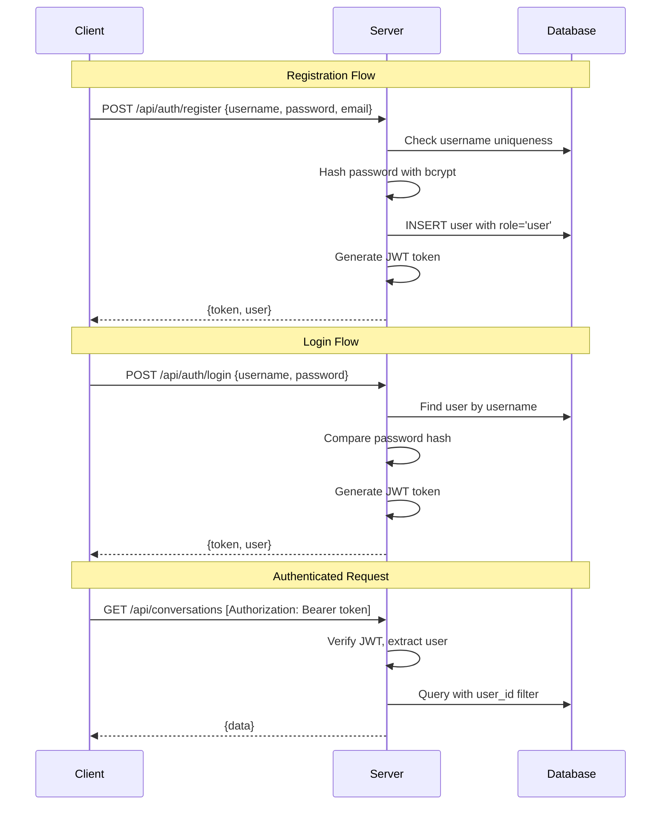

# User Tiered Management System — Architecture Plan

## Overview

Add a full authentication and role-based access control system with three user tiers:
- **Guest**: Unauthenticated visitors — can browse the UI but cannot send chat messages
- **Regular User**: Authenticated users — can chat, manage their own conversations
- **Admin**: Full access — can manage users, stations, settings, and all platform features

## Architecture Diagram

```mermaid
flowchart TB
    subgraph Client
        LoginPage[Login Page]
        RegisterPage[Register Page]
        AuthStore[Zustand AuthStore]
        Layout[Layout with Auth Guard]
        ChatUI[Chat UI]
        AdminUI[Admin User Management]
    end

    subgraph Server
        AuthRoutes[/api/auth - login/register/me]
        UserRoutes[/api/users - admin CRUD]
        AuthMiddleware[JWT Auth Middleware]
        RoleMiddleware[Role Check Middleware]
        DB[(SQLite - users table)]
    end

    LoginPage --> AuthRoutes
    RegisterPage --> AuthRoutes
    AuthStore --> AuthRoutes
    AuthStore --> Layout
    Layout --> ChatUI
    Layout --> AdminUI
    AuthRoutes --> AuthMiddleware
    AuthRoutes --> DB
    UserRoutes --> RoleMiddleware
    RoleMiddleware --> AuthMiddleware
    UserRoutes --> DB
```

## Role Permissions Matrix

```mermaid
flowchart LR
    subgraph Guest
        G1[Browse UI]
        G2[View models]
        G3[Register/Login]
    end

    subgraph Regular User
        U1[All Guest features]
        U2[Send chat messages]
        U3[Manage own conversations]
        U4[View own memories]
    end

    subgraph Admin
        A1[All User features]
        A2[Manage stations]
        A3[Manage all users]
        A4[System settings]
    end

    Guest --> Regular User
    Regular User --> Admin
```

## Database Schema

### New table: `users`

```sql
CREATE TABLE IF NOT EXISTS users (
  id TEXT PRIMARY KEY,
  username TEXT NOT NULL UNIQUE,
  email TEXT UNIQUE,
  password_hash TEXT NOT NULL,
  display_name TEXT,
  role TEXT NOT NULL DEFAULT 'user' CHECK(role IN ('admin', 'user')),
  is_active INTEGER NOT NULL DEFAULT 1,
  last_login TEXT,
  created_at TEXT NOT NULL DEFAULT (datetime('now')),
  updated_at TEXT NOT NULL DEFAULT (datetime('now'))
);
CREATE UNIQUE INDEX IF NOT EXISTS idx_users_username ON users(username);
CREATE UNIQUE INDEX IF NOT EXISTS idx_users_email ON users(email);
```

### Modified tables

Add `user_id` column to `conversations` table:
```sql
ALTER TABLE conversations ADD COLUMN user_id TEXT REFERENCES users(id);
```

## Auth Flow



## File Changes Summary

### Server — New Files
| File | Purpose |
|------|---------|
| `server/src/middleware/auth.ts` | JWT verification + role-based access middleware |
| `server/src/routes/auth.ts` | `/api/auth` — register, login, get current user |
| `server/src/routes/users.ts` | `/api/users` — admin CRUD for user management |

### Server — Modified Files
| File | Changes |
|------|---------|
| `server/src/database.ts` | Add `users` table, add `user_id` to conversations |
| `server/src/types.ts` | Add User, AuthRequest, AuthResponse types |
| `server/src/index.ts` | Wire auth + user routes |
| `server/src/routes/conversations.ts` | Filter by user_id when authenticated |
| `server/src/routes/chat.ts` | Require auth to send messages |
| `server/package.json` | Add jsonwebtoken, bcryptjs |

### Client — New Files
| File | Purpose |
|------|---------|
| `client/src/components/auth/LoginPage.tsx` | Login form |
| `client/src/components/auth/RegisterPage.tsx` | Registration form |
| `client/src/components/settings/UserManagement.tsx` | Admin user list/CRUD |
| `client/src/stores/authStore.ts` | Zustand store for auth state |

### Client — Modified Files
| File | Changes |
|------|---------|
| `client/src/types/index.ts` | Add User, Auth types |
| `client/src/services/api.ts` | Add auth API, add token to requests |
| `client/src/App.tsx` | Auth routing (login/register/main) |
| `client/src/components/layout/Layout.tsx` | Role-based UI visibility |
| `client/src/components/layout/Sidebar.tsx` | Show user info, logout, admin links |
| `client/src/components/chat/ChatInput.tsx` | Disable for guests |
| `client/src/components/settings/SettingsPage.tsx` | Admin-only station management |

## Default Admin Account

On first server start, if no admin user exists, automatically create:
- Username: `admin`
- Password: `admin123` (should be changed after first login)
- Role: `admin`

This ensures the system is immediately usable after setup.
